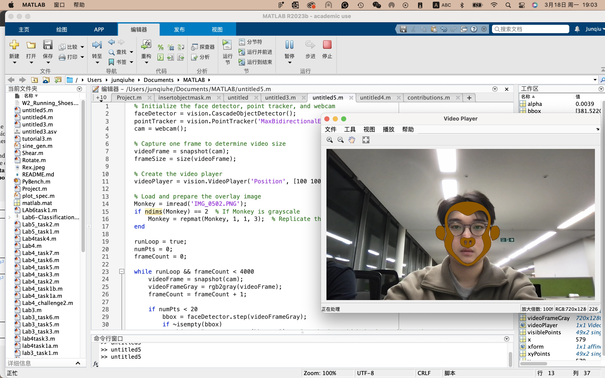
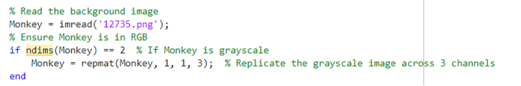
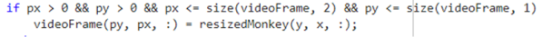
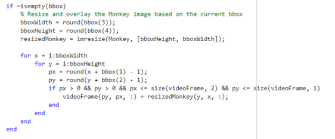
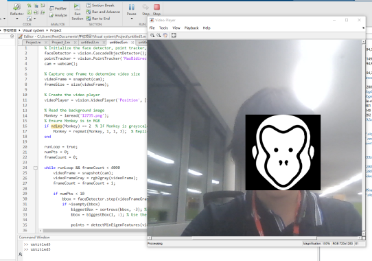
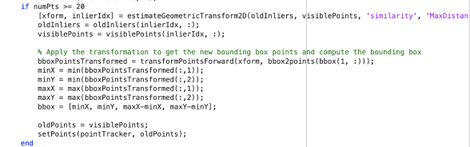
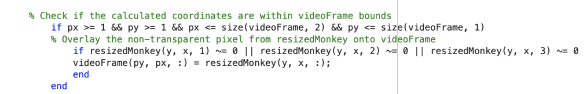

# Visual System Final Project Jiayi Chen & Junqiu He

Team Report

## Project brief

The aim of this project is to use MATLAB to create a filter that can detect and track human faces in the webcam feed and overlay any image on it. When the code is running, it sets up a face detector, a point tracker, and a webcam. It then captures one frame from the webcam to determine the size of the video feed. It then loads the image (either grayscale or RGB) and ensures it has three color channels. 

For the main loop, it detects human faces in each frame using the face detector and tracks the largest detected face using the point tracker. Then it resizes the monkey image and overlays it onto the detected face in the video frame. The overlaid video frames are displayed using a video player object. This system offers a playful feature to live video feeds, demonstrating the real-time face tracking and image processing aspects of visual system technologies.

## Presets
 
For the basic face detection algorithm of this project we were using this example from mathworks (https://uk.mathworks.com/help/vision/ug/face-detection-and-tracking-using-live-video-acquisition.html?searchHighlight=face%20detection%20&s_tid=srchtitle_support_results_10_face%2520detection%2520) and some functions it utilized require the download of the latest matlab version(2023b), also the following add-ons is must be installed for the code to run successfully.  

  

## Testing

When the code runs, it adds a monkey image to your face, and the image tracks and remains in position with the movement of your face within the screen. It only tracks one face at a time, and the addition of a second person in the frame won’t affect the image overlaying the first tester. The image may occasionally get out of position, but blocking the camera view for a second or exposing the tester’s face more in front of the camera can fix this issue.

Here is a screenshot of the code in action:

  

# Personal Statment

## Jiayi Chen CID:01883225

My contribution to the project mainly focused on overlaying the image onto our detected face and ensuring it matches the movements detected by the tracker. First, I needed to ensure the imported image had the correct color channels, so I added an inspection code to check whether the image is RGB or grayscale, and replicate the grayscale image across three channels when needed.

Then, to overlay the image, I first checked the variable ‘bbox’. If it’s not empty, it indicates that a face has been detected in the current frame. Then, I used the 'imresize' function to ensure that the Monkey image aligns properly within the size of the detected face. To lock it in position with the face in the video, a 'for' loop is set to iterate over each pixel within the bounding box. It calculates the corresponding pixel coordinates (px refers to the horizontal position (column) of the pixel, while py refers to the vertical position (row)) in the original video frame (videoFrame). Finally, I copied the Monkey image pixel value at the corresponding position (x, y) onto the video frame at the calculated pixel coordinates (px, py) to overlay the image on it.

  

However, after my first testing, I encountered an error where the coordinates may exceed the bounds of the video frame. So, I added code to check if the calculated pixel coordinates fall within the bounds.

  

Inspired by Lab 3, in the code 'px > 0' checks if the horizontal coordinate is greater than 0, ensuring that it falls within the left boundary of the video frame. Similarly, 'py > 0' checks if the vertical coordinate is within the top boundary. In addition, it also compares 'px' and 'py' to the width and height of the video frame, making sure it stays within the screen area ('px <= size(videoFrame, 2)', 'py <= size(videoFrame, 1)').

The final code looks like this. While it managed to do the job, the monkey image I used has a transparent background, but when I overlay it onto the video frame, the transparent parts are being replaced with black. It seems like the transparency of the Monkey image is not taken into account when blending it with the video frame; we need some fixing on the color channel of the image.

  

  

# Personal Statement

## Junqiu He CID:01860494

My contribution to the project mainly focused on finding the basic face detection algorithm, develop each parameters for further adoption, and make the background of the overlayed monkey image to be transparent. 

The basic face detection algorithm have 3 main components: face detector, point tracker and the webcam. The built in function ‘vision.CascadeObjectDetector()’ in Matlab, it is capable of detecting people’s faces, noses, eyes, mouth, or upper body by using the Viola-Jones algorithm. The function is especially useful and suitable for our project that requires a detection of users’ faces. The point tracker is created by the ‘vision.PointTracker’ function, while it ensure the detected face features are tracked in the following steps. It is very useful in tracking objects that do not change shape and it is capable to use in video mode. Finally, the webcam is accessed using ‘cam = webcam()’. 

Video frames are displayed using the ‘vision.Videoplayer()’ function. Size of the video is captured by the function ‘snapshot(cam)’. The monkey image is loaded and stored in matrix form using ‘imread()’. By editing the context inside the ‘imread()’ function, we are able to change different face filters apart from the monkey image shown in the example screenshot. 

The main loop in the algorithm have an editable frame count and was set to 4000, so that we could ensure it lasts for the whole recording process. Initially, it detects the faces in the grayscale frame using the function ‘faceDetector’, and if a face is detected, it selects the largest face (with most numbers of key features) and initialise the point tracker with the detected feature points. Once enough key features are detected, it tracks these points in the following frames using the parameter pointTracker mentioned previously. In the code we test with a set of numbers and find out that when the number is 20, it has the best sensitivity to human face and stability. With less number such as 10 might cause the algorithm sometimes track the features in the background rather than face. 

The following code transform the detected bounding box points and update the coordinates accordingly. The function ‘bbox2points(bbox(1, :))’ converts the bounding box coordinates into four corner points of the box. Then, after the transformation, the transformed coordinates are recorded through the parameter ‘bboxPointsTransformed’. Finally, the bounding box is updated with the value minX, minY, maxX, maxY that determined the minimum and maximum coordinates along x and y axes. It ensures the monkey image remains overlayed on the detected face as the face moving. 

  

The transparent issue that took place in the previous version is solved by adding the checking function shown here. If the calculated coordinates are within the bounds and the corresponding pixel in the ‘resizedMonkey’ is not fully transparent, the pixel value from the monkey image is overlaid onto the ‘videoFrame’. The condition ‘resizedMonkey(y, x, 1)’; ‘resizedMonkey(y, x, 2)’; ‘resizedMonkey(y, x, 3)’ checks if any of the color channels (red, green, or blue) are non-zero. If any channel has a non-zero value, it means that the pixel is not fully transparent, so it's overlaid onto the video frame. 

  

